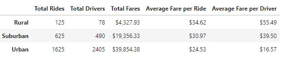
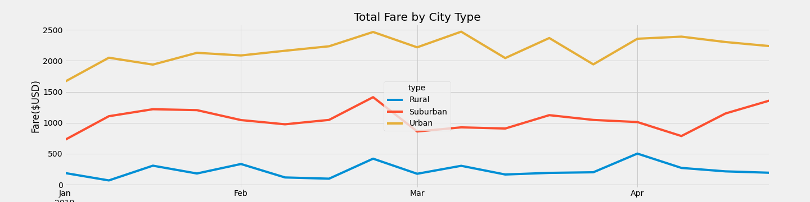

# PyBer_Analysis

## Deliverable #1: A ride-sharing summary DataFrame by city type.

## Deliverable #2: A multiple-line chart of total fares for each city type.

## Deliverable #3: A written report for the PyBer analysis. 
* This analysis could be used to highlight the differences in the prices of rides based on different types of cities.  
* Based on our analysis, it looks like the rides in Urban cities are the least expensive, where rides in Rural cities are the most expensive, on average. 

### Analysis Suggestions: 
1. Rural cities are generating the least total fares in spite of being the most epensinve fares on average. Parhaps some ride incentives such as coupons could boost ride numbers and total fares in Rural communities. 
2. Urban cities make the most total fare revenue  by far. It would likely be more efficient to focus business efforts in Urban areas. 
3. Urban cities also had more drivers than actual rides. Rides may be more lucritave per ride if there were fewer drivers in Urban areas. 
